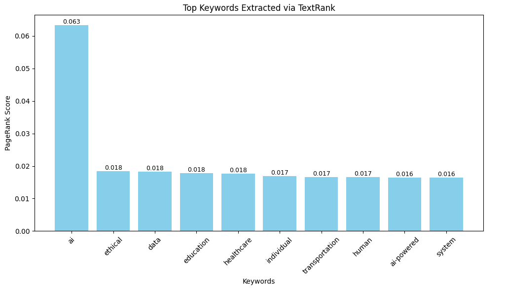

# textrank_keyword_extractor

This project demonstrates keyword extraction using the TextRank algorithm implemented with NLTK. It processes input text by tokenizing, POS tagging, lemmatizing, and building a word co-occurrence graph to identify the most relevant terms. The results are visualized using a bar chart for better interpretability.

## Input Text

Artificial Intelligence (AI) is rapidly transforming industries across the globe. From healthcare and education to finance and transportation, AI is improving efficiency, accuracy, and decision-making capabilities. In healthcare, AI-powered systems assist doctors in diagnosing diseases such as cancer more quickly and accurately. Machine learning algorithms analyze vast amounts of patient data to identify patterns that humans may miss.

In the financial sector, AI helps detect fraudulent transactions and automates investment strategies. Robo-advisors are increasingly being used by individuals to manage their portfolios. In education, AI-powered learning platforms adapt to individual students' needs, offering personalized content and real-time feedback.

Self-driving cars are one of the most visible applications of AI in transportation. These vehicles use computer vision, sensors, and neural networks to navigate safely through traffic. Moreover, natural language processing enables AI systems to understand and respond to human language, making virtual assistants like Siri and Alexa more effective.

Despite its benefits, AI also raises ethical concerns, such as data privacy, job displacement, and algorithmic bias. As AI becomes more integrated into daily life, it is crucial to establish clear regulations and ethical guidelines to ensure its responsible use.

Overall, AI represents both an opportunity and a challenge for modern society. Its continued development will shape the future in ways we are only beginning to understand.

## Output

